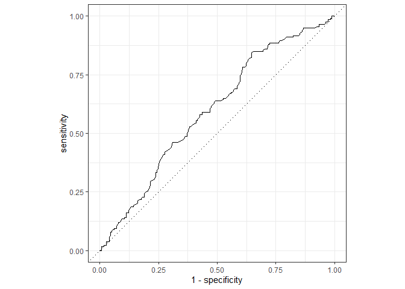
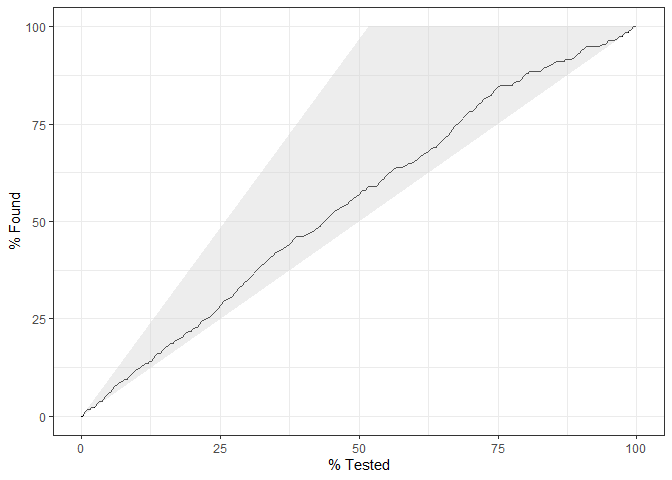
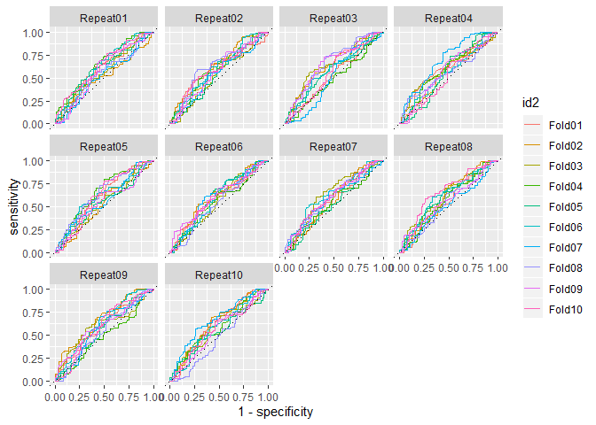
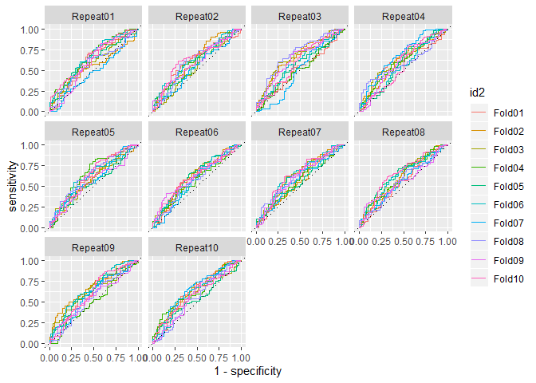
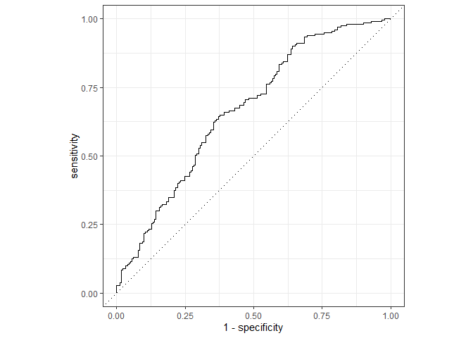
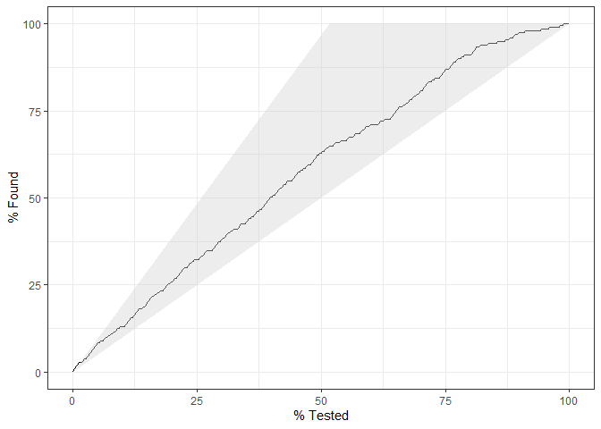
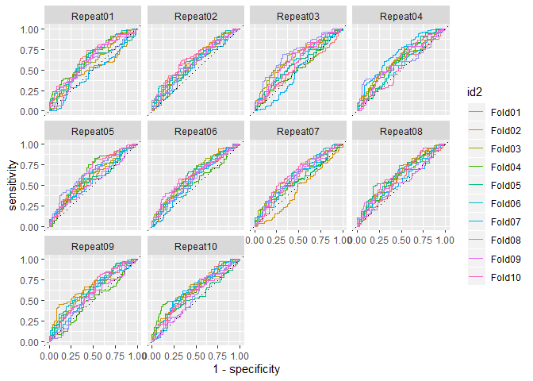

Assignment 3 - Part 2 - Diagnosing schizophrenia from voice
-----------------------------------------------------------

In the previous part of the assignment you generated a bunch of
“features”, that is, of quantitative descriptors of voice in
schizophrenia. We then looked at whether we could replicate results from
the previous literature. We now want to know whether we can
automatically diagnose schizophrenia from voice only, that is, relying
on the set of features you produced last time, we will try to produce an
automated classifier. Again, remember that the dataset containst 7
studies and 3 languages. Feel free to only include Danish (Study 1-4) if
you feel that adds too much complexity.

Issues to be discussed your report: - Should you run the analysis on all
languages/studies at the same time? - Choose your best acoustic feature
from part 1. How well can you diagnose schizophrenia just using it? -
Identify the best combination of acoustic features to diagnose
schizophrenia using logistic regression. - Discuss the “classification”
process: which methods are you using? Which confounds should you be
aware of? What are the strength and limitation of the analysis? - Bonus
question: Logistic regression is only one of many classification
algorithms. Try using others and compare performance. Some examples:
Discriminant Function, Random Forest, Support Vector Machine, etc. The
package caret provides them. - Bonus Bonus question: It is possible
combine the output of multiple classification models to improve
classification accuracy. For inspiration see,
<a href="https://machinelearningmastery.com/machine-learning-ensembles-with-r/" class="uri">https://machinelearningmastery.com/machine-learning-ensembles-with-r/</a>
The interested reader might also want to look up ‘The BigChaos Solution
to the Netflix Grand Prize’

Learning objectives
-------------------

-   Learn the basics of classification in a machine learning framework
-   Design, fit and report logistic regressions
-   Apply feature selection techniques

### Let’s start

We first want to build a logistic regression to see whether you can
diagnose schizophrenia from your best acoustic feature. Let’s use the
full dataset and calculate the different performance measures (accuracy,
sensitivity, specificity, PPV, NPV, ROC curve). You need to think
carefully as to how we should (or not) use study and subject ID.

Then cross-validate the logistic regression and re-calculate performance
on the testing folds. N.B. The cross-validation functions you already
have should be tweaked: you need to calculate these new performance
measures. Alternatively, the groupdata2 and cvms package created by
Ludvig are an easy solution.

N.B. the predict() function generates log odds (the full scale between
minus and plus infinity). Log odds &gt; 0 indicates a choice of 1, below
a choice of 0. N.N.B. you need to decide whether calculate performance
on each single test fold or save all the prediction for test folds in
one datase, so to calculate overall performance. N.N.N.B. Now you have
two levels of structure: subject and study. Should this impact your
cross-validation? N.N.N.N.B. A more advanced solution could rely on the
tidymodels set of packages (warning: Time-consuming to learn as the
documentation is sparse, but totally worth it)

``` r
# Loading packages
library(pacman)
p_load(tidyverse, tidymodels, groupdata2)

# Loading data from part 1
data <- read_csv("data_af")
```

    ## Parsed with column specification:
    ## cols(
    ##   .default = col_double(),
    ##   Language = col_character(),
    ##   Gender = col_character(),
    ##   soundname = col_character()
    ## )

    ## See spec(...) for full column specifications.

``` r
# Changing diagnosis to be a factor
data$Diagnosis <- as.factor(data$Diagnosis)

# Removing rows with NAs in the four columns of interest
data <- filter(data, !is.na(ScaledPitchIQR))
data <- filter(data, !is.na(ScaledSpokenProb))
data <- filter(data, !is.na(ScaledSpeechRate))
data <- filter(data, !is.na(ScaledPauseDur))

# Setting seed
set.seed(69)

# Partitioning the data (making sure, that the matched pairs are represented in the same data set)
data_list <- partition(data, p = 0.2, cat_col = c("Diagnosis"), id_col = "UniquePair", list_out = T)

df_test <- data_list[[1]]
df_train = data_list[[2]]
```

MODEL 1 - THE BEST FEATURE FROM A3\_P1

``` r
# Defining "recipe" for preprocessing of the data
# Creating recipe
rec <- df_train %>%
  recipe(Diagnosis ~ ScaledSpeechRate) %>% # defines the outcome and predictor(s) - the feature, which is best described by diagnosis in P1.
  step_center(all_numeric()) %>% # centers numeric predictors
  step_corr(all_numeric()) %>% # removes variables with large correlations with other variables
  check_missing(everything()) %>% # Checking for NAs
  prep(training = df_train)

# Looking at the ouput and the operations performed
rec
```

    ## Data Recipe
    ## 
    ## Inputs:
    ## 
    ##       role #variables
    ##    outcome          1
    ##  predictor          1
    ## 
    ## Training data contained 1522 data points and no missing data.
    ## 
    ## Operations:
    ## 
    ## Centering for ScaledSpeechRate [trained]
    ## Correlation filter removed no terms [trained]
    ## Check missing values for ScaledSpeechRate, Diagnosis [trained]

``` r
# Extracting the relevant data (predictor and outcome variables) from training set
train_baked <- juice(rec)

# Applying recipe (which was used for training data) to test data (the training data has already been prepped)
test_baked <- rec %>%
  bake(df_test)
```

``` r
# Creating models

# Logistic regression in tidymodels
log_fit <- 
  logistic_reg() %>%
  set_mode("classification") %>% 
  set_engine("glm") %>%
  fit(Diagnosis ~ ScaledSpeechRate, data = train_baked)
# Combining the actual diagnoses, probabilities of diagnose/control and predictions of the classifications.
test_results <- 
  test_baked %>% 
  select(Diagnosis) %>% 
  mutate(
    log_class = predict(log_fit, new_data = test_baked) %>% 
      pull(.pred_class),
    log_prob  = predict(log_fit, new_data = test_baked, type = "prob") %>% 
      pull(.pred_1)
  )
```

``` r
# Applying model to test set

# Getting probability of class
log_prob <- log_fit %>%
  predict(new_data = test_baked, type = "prob") %>% # Specifying the output to be in probabilities
  pull(.pred_1) # Pulling the probabilities of being diagnosed (contrary to control = .pred_0)

# Predicting class
log_class <- log_fit %>%
  predict(new_data = test_baked) # Makes the output the default - the classifications which we predict.

# Combining the actual diagnoses, probabilities of diagnose/control and predictions of the classifications.
test_results <- 
  test_baked %>% 
  select(Diagnosis) %>% 
  mutate(
    log_class = predict(log_fit, new_data = test_baked) %>% 
      pull(.pred_class),
    log_prob  = predict(log_fit, new_data = test_baked, type = "prob") %>% 
      pull(.pred_1)
  )

# Examining the first 10
test_results %>% 
  head(10)
```

    ## # A tibble: 10 x 3
    ##    Diagnosis log_class log_prob
    ##    <fct>     <fct>        <dbl>
    ##  1 0         0            0.432
    ##  2 0         1            0.551
    ##  3 0         0            0.461
    ##  4 0         0            0.455
    ##  5 0         0            0.454
    ##  6 0         1            0.510
    ##  7 0         1            0.538
    ##  8 0         1            0.521
    ##  9 0         1            0.515
    ## 10 0         0            0.368

``` r
# Performance metrics
multimetric <- metric_set(accuracy, bal_accuracy, sens, spec, ppv, npv, kap) # Defining interesting performance metrics
full_eval <- bind_rows(
  multimetric(bind_cols(test_baked, test_results), truth = Diagnosis, estimate = log_class))
full_eval
```

    ## # A tibble: 7 x 3
    ##   .metric      .estimator .estimate
    ##   <chr>        <chr>          <dbl>
    ## 1 accuracy     binary         0.561
    ## 2 bal_accuracy binary         0.557
    ## 3 sens         binary         0.684
    ## 4 spec         binary         0.431
    ## 5 ppv          binary         0.562
    ## 6 npv          binary         0.561
    ## 7 kap          binary         0.116

``` r
# Plotting the roc curve:
test_results %>%
  roc_curve(truth = Diagnosis, log_prob) %>% # Defining "Diagnosis" as the actual results, while log_prob are the probabilities of a certain classification.
  autoplot() # Plots the curve
```



``` r
# Plotting a gain curve
test_results %>% 
  mutate(log_prob = 1 - log_prob) %>% # for the plot to show correctly (otherwise the line would be flipped)
  gain_curve(truth = Diagnosis, log_prob) %>% 
  autoplot()
```



CROSS VALIDATION OF MODEL 1

``` r
# Multiple cross validation of all models
# Setting seed
set.seed(69)

# Creating 10 folds, 10 times, and making sure that Diagnosis is balanced across groups
cv_folds <- vfold_cv(df_train, v = 10, repeats = 10, strata = Diagnosis, group = UniquePair)

# Preparing data set and fetch train data
cv_folds <- cv_folds %>% 
  mutate(recipes = splits %>%
           # prepper is a wrapper for `prep()` which handles `split` objects
           map(prepper, recipe = rec),
         train_data = splits %>% map(training))

# Training a model of each fold

# Creating a non-fitted model
log_fit <- 
  logistic_reg() %>%
  set_mode("classification") %>% 
  set_engine("glm") 

cv_folds <- cv_folds %>%  mutate(
  log_fits = pmap(list(recipes, train_data), #input 
                            ~ fit(log_fit, formula(.x), data = bake(object = .x, new_data = .y)) # function to apply
                 ))

# Looking at the output
cv_folds %>% head(5)
```

    ## # A tibble: 5 x 6
    ##   splits          id       id2    recipes    train_data         log_fits   
    ## * <named list>    <chr>    <chr>  <named li> <named list>       <named lis>
    ## 1 <split [1.4K/1~ Repeat01 Fold01 <recipe>   <tibble [1,369 x ~ <fit[+]>   
    ## 2 <split [1.4K/1~ Repeat01 Fold02 <recipe>   <tibble [1,369 x ~ <fit[+]>   
    ## 3 <split [1.4K/1~ Repeat01 Fold03 <recipe>   <tibble [1,370 x ~ <fit[+]>   
    ## 4 <split [1.4K/1~ Repeat01 Fold04 <recipe>   <tibble [1,370 x ~ <fit[+]>   
    ## 5 <split [1.4K/1~ Repeat01 Fold05 <recipe>   <tibble [1,370 x ~ <fit[+]>

``` r
# Defining a function to predict (resulting in tibble of actual and predicted results)
predict_log <- function(split, rec, model) {
  # IN
    # split: a split data
    # rec: recipe to prepare the data
    # model
  # OUT
    # a tibble of the actual and predicted results
  baked_test <- bake(rec, testing(split))
  tibble(
    actual = baked_test$Diagnosis,
    predicted = predict(model, new_data = baked_test) %>% pull(.pred_class),
    prob_scz =  predict(model, new_data = baked_test, type = "prob") %>% pull(.pred_1),
    prob_control =  predict(model, new_data = baked_test, type = "prob") %>% pull(.pred_0)
  ) 
}

# Applying the function to each split, with their respective recipes and models (in this case log fits) and save it to a new col
cv_folds <- cv_folds %>% 
  mutate(pred = pmap(list(splits, recipes, log_fits) , predict_log))
```

``` r
# Performance Metrics
eval <- 
  cv_folds %>% 
  mutate(metrics = pmap(list(pred), ~ multimetric(., truth = actual, estimate = predicted, prob_scz))) %>% 
  select(id, id2, metrics) %>% 
  unnest(metrics)

# Receiver operator curve
cv_folds %>% 
  mutate(roc = pmap(list(pred), roc_curve, truth = actual, prob_scz)) %>% 
  unnest(roc) %>% 
  ggplot() +
  aes(x = 1 - specificity, y = sensitivity, color = id2) +
  geom_path() +
  geom_abline(lty = 3) + facet_wrap(~id)
```



``` r
# Inspecting performance metrics
eval %>% 
  select(repeat_n = id, fold_n = id2, metric = .metric, estimate = .estimate) %>% 
  spread(metric, estimate) %>% arrange(desc(kap)) %>% 
  summarise(N = n(),
  m_accuracy = mean(accuracy),
  m_bal_accuracy = mean(bal_accuracy),
  m_sens = mean(sens),
  m_spec = mean(spec),
  m_ppv = mean(ppv),
  m_npv = mean(npv),
  m_kap = mean(kap)
  )
```

    ## # A tibble: 1 x 8
    ##       N m_accuracy m_bal_accuracy m_sens m_spec m_ppv m_npv m_kap
    ##   <int>      <dbl>          <dbl>  <dbl>  <dbl> <dbl> <dbl> <dbl>
    ## 1   100      0.573          0.566  0.710  0.422 0.577 0.568 0.133

MODEL 2 - THE TWO BEST FEATURES FROM A3\_P1

``` r
# Defining "recipe" for preprocessing of the data
# Creating recipe
rec <- df_train %>%
  recipe(Diagnosis ~ ScaledSpeechRate + ScaledPitchIQR) %>% # defines the outcome and predictor(s) - the feature, which is best described by diagnosis in P1.
  step_center(all_numeric()) %>% # centers numeric predictors
  step_corr(all_numeric()) %>% # removes variables with large correlations with other variables
  check_missing(everything()) %>% # Checking for NAs
  prep(training = df_train)

# Looking at the ouput and the operations performed
rec
```

    ## Data Recipe
    ## 
    ## Inputs:
    ## 
    ##       role #variables
    ##    outcome          1
    ##  predictor          2
    ## 
    ## Training data contained 1522 data points and no missing data.
    ## 
    ## Operations:
    ## 
    ## Centering for ScaledSpeechRate, ScaledPitchIQR [trained]
    ## Correlation filter removed no terms [trained]
    ## Check missing values for ScaledSpeechRate, ... [trained]

``` r
# Extracting the relevant data (predictor and outcome variables) from training set
train_baked <- juice(rec)

# Applying recipe (which was used for training data) to test data (the training data has already been prepped)
test_baked <- rec %>%
  bake(df_test)
```

``` r
# Creating models

# Logistic regression in tidymodels
log_fit <- 
  logistic_reg() %>%
  set_mode("classification") %>% 
  set_engine("glm") %>%
  fit(Diagnosis ~ ScaledSpeechRate + ScaledPitchIQR, data = train_baked)
# Combining the actual diagnoses, probabilities of diagnose/control and predictions of the classifications.
test_results <- 
  test_baked %>% 
  select(Diagnosis) %>% 
  mutate(
    log_class = predict(log_fit, new_data = test_baked) %>% 
      pull(.pred_class),
    log_prob  = predict(log_fit, new_data = test_baked, type = "prob") %>% 
      pull(.pred_1)
  )
```

``` r
# Applying model to test set

# Getting probability of class
log_prob <- log_fit %>%
  predict(new_data = test_baked, type = "prob") %>% # Specifying the output to be in probabilities
  pull(.pred_1) # Pulling the probabilities of being diagnosed (contrary to control = .pred_0)

# Predicting class
log_class <- log_fit %>%
  predict(new_data = test_baked) # Makes the output the default - the classifications which we predict.

# Combining the actual diagnoses, probabilities of diagnose/control and predictions of the classifications.
test_results <- 
  test_baked %>% 
  select(Diagnosis) %>% 
  mutate(
    log_class = predict(log_fit, new_data = test_baked) %>% 
      pull(.pred_class),
    log_prob  = predict(log_fit, new_data = test_baked, type = "prob") %>% 
      pull(.pred_1)
  )

# Examining the first 10
test_results %>% 
  head(10)
```

    ## # A tibble: 10 x 3
    ##    Diagnosis log_class log_prob
    ##    <fct>     <fct>        <dbl>
    ##  1 0         0            0.455
    ##  2 0         1            0.560
    ##  3 0         0            0.480
    ##  4 0         0            0.474
    ##  5 0         0            0.476
    ##  6 0         1            0.526
    ##  7 0         1            0.549
    ##  8 0         1            0.543
    ##  9 0         1            0.530
    ## 10 0         0            0.394

``` r
# Performance metrics
multimetric <- metric_set(accuracy, bal_accuracy, sens, spec, ppv, npv, kap) # Defining interesting performance metrics
full_eval <- bind_rows(
  multimetric(bind_cols(test_baked, test_results), truth = Diagnosis, estimate = log_class))
full_eval
```

    ## # A tibble: 7 x 3
    ##   .metric      .estimator .estimate
    ##   <chr>        <chr>          <dbl>
    ## 1 accuracy     binary         0.607
    ## 2 bal_accuracy binary         0.603
    ## 3 sens         binary         0.731
    ## 4 spec         binary         0.475
    ## 5 ppv          binary         0.597
    ## 6 npv          binary         0.623
    ## 7 kap          binary         0.207

``` r
# Plotting the roc curve:
test_results %>%
  roc_curve(truth = Diagnosis, log_prob) %>% # Defining "Diagnosis" as the actual results, while log_prob are the probabilities of a certain classification.
  autoplot() # Plots the curve
```


``` r
# Plotting a gain curve
test_results %>% 
  mutate(log_prob = 1 - log_prob) %>% # for the plot to show correctly (otherwise the line would be flipped)
  gain_curve(truth = Diagnosis, log_prob) %>% 
  autoplot()
```


CROSS VALIDATION OF MODEL 2

``` r
# Multiple cross validation of all models
# Setting seed
set.seed(69)

# Creating 10 folds, 10 times, and making sure that Diagnosis is balanced across groups
cv_folds <- vfold_cv(df_train, v = 10, repeats = 10, strata = Diagnosis, group = UniquePair)

# Preparing data set and fetch train data
cv_folds <- cv_folds %>% 
  mutate(recipes = splits %>%
           # prepper is a wrapper for `prep()` which handles `split` objects
           map(prepper, recipe = rec),
         train_data = splits %>% map(training))

# Training a model of each fold

# Creating a non-fitted model
log_fit <- 
  logistic_reg() %>%
  set_mode("classification") %>% 
  set_engine("glm") 

cv_folds <- cv_folds %>%  mutate(
  log_fits = pmap(list(recipes, train_data), #input 
                            ~ fit(log_fit, formula(.x), data = bake(object = .x, new_data = .y)) # function to apply
                 ))

# Looking at the output
cv_folds %>% head(5)
```

    ## # A tibble: 5 x 6
    ##   splits          id       id2    recipes    train_data         log_fits   
    ## * <named list>    <chr>    <chr>  <named li> <named list>       <named lis>
    ## 1 <split [1.4K/1~ Repeat01 Fold01 <recipe>   <tibble [1,369 x ~ <fit[+]>   
    ## 2 <split [1.4K/1~ Repeat01 Fold02 <recipe>   <tibble [1,369 x ~ <fit[+]>   
    ## 3 <split [1.4K/1~ Repeat01 Fold03 <recipe>   <tibble [1,370 x ~ <fit[+]>   
    ## 4 <split [1.4K/1~ Repeat01 Fold04 <recipe>   <tibble [1,370 x ~ <fit[+]>   
    ## 5 <split [1.4K/1~ Repeat01 Fold05 <recipe>   <tibble [1,370 x ~ <fit[+]>

``` r
# Applying the function to each split, with their respective recipes and models (in this case log fits) and save it to a new col
cv_folds <- cv_folds %>% 
  mutate(pred = pmap(list(splits, recipes, log_fits) , predict_log))
```

``` r
# Performance Metrics
eval <- 
  cv_folds %>% 
  mutate(metrics = pmap(list(pred), ~ multimetric(., truth = actual, estimate = predicted, prob_scz))) %>% 
  select(id, id2, metrics) %>% 
  unnest(metrics)

# Receiver operator curve
cv_folds %>% 
  mutate(roc = pmap(list(pred), roc_curve, truth = actual, prob_scz)) %>% 
  unnest(roc) %>% 
  ggplot() +
  aes(x = 1 - specificity, y = sensitivity, color = id2) +
  geom_path() +
  geom_abline(lty = 3) + facet_wrap(~id)
```



``` r
# Inspecting performance metrics
eval %>% 
  select(repeat_n = id, fold_n = id2, metric = .metric, estimate = .estimate) %>% 
  spread(metric, estimate) %>% arrange(desc(kap)) %>% 
  summarise(N = n(),
  m_accuracy = mean(accuracy),
  m_bal_accuracy = mean(bal_accuracy),
  m_sens = mean(sens),
  m_spec = mean(spec),
  m_ppv = mean(ppv),
  m_npv = mean(npv),
  m_kap = mean(kap)
  )
```

    ## # A tibble: 1 x 8
    ##       N m_accuracy m_bal_accuracy m_sens m_spec m_ppv m_npv m_kap
    ##   <int>      <dbl>          <dbl>  <dbl>  <dbl> <dbl> <dbl> <dbl>
    ## 1   100      0.578          0.573  0.672  0.473 0.586 0.566 0.146

MODEL 3 - THE THREE SIGNIFICANT FEATURES (AND WITH THE BIGGEST EFFECT
SIZES) FROM A3\_P1

``` r
# Defining "recipe" for preprocessing of the data
# Creating recipe
rec <- df_train %>%
  recipe(Diagnosis ~ ScaledSpeechRate + ScaledPitchIQR + ScaledPauseDur) %>% # defines the outcome and predictor(s) - the feature, which is best described by diagnosis in P1.
  step_center(all_numeric()) %>% # centers numeric predictors
  step_corr(all_numeric()) %>% # removes variables with large correlations with other variables
  check_missing(everything()) %>% # Checking for NAs
  prep(training = df_train)

# Looking at the ouput and the operations performed
rec
```

    ## Data Recipe
    ## 
    ## Inputs:
    ## 
    ##       role #variables
    ##    outcome          1
    ##  predictor          3
    ## 
    ## Training data contained 1522 data points and no missing data.
    ## 
    ## Operations:
    ## 
    ## Centering for ScaledSpeechRate, ... [trained]
    ## Correlation filter removed no terms [trained]
    ## Check missing values for ScaledSpeechRate, ... [trained]

``` r
# Extracting the relevant data (predictor and outcome variables) from training set
train_baked <- juice(rec)

# Applying recipe (which was used for training data) to test data (the training data has already been prepped)
test_baked <- rec %>%
  bake(df_test)
```

``` r
# Creating models

# Logistic regression in tidymodels
log_fit <- 
  logistic_reg() %>%
  set_mode("classification") %>% 
  set_engine("glm") %>%
  fit(Diagnosis ~ ScaledSpeechRate + ScaledPitchIQR + ScaledPauseDur, data = train_baked)
# Combining the actual diagnoses, probabilities of diagnose/control and predictions of the classifications.
test_results <- 
  test_baked %>% 
  select(Diagnosis) %>% 
  mutate(
    log_class = predict(log_fit, new_data = test_baked) %>% 
      pull(.pred_class),
    log_prob  = predict(log_fit, new_data = test_baked, type = "prob") %>% 
      pull(.pred_1)
  )
```

``` r
# Applying model to test set

# Getting probability of class
log_prob <- log_fit %>%
  predict(new_data = test_baked, type = "prob") %>% # Specifying the output to be in probabilities
  pull(.pred_1) # Pulling the probabilities of being diagnosed (contrary to control = .pred_0)

# Predicting class
log_class <- log_fit %>%
  predict(new_data = test_baked) # Makes the output the default - the classifications which we predict.

# Combining the actual diagnoses, probabilities of diagnose/control and predictions of the classifications.
test_results <- 
  test_baked %>% 
  select(Diagnosis) %>% 
  mutate(
    log_class = predict(log_fit, new_data = test_baked) %>% 
      pull(.pred_class),
    log_prob  = predict(log_fit, new_data = test_baked, type = "prob") %>% 
      pull(.pred_1)
  )

# Examining the first 10
test_results %>% 
  head(10)
```

    ## # A tibble: 10 x 3
    ##    Diagnosis log_class log_prob
    ##    <fct>     <fct>        <dbl>
    ##  1 0         0            0.454
    ##  2 0         1            0.583
    ##  3 0         0            0.462
    ##  4 0         0            0.462
    ##  5 0         0            0.458
    ##  6 0         1            0.517
    ##  7 0         1            0.546
    ##  8 0         1            0.544
    ##  9 0         1            0.503
    ## 10 0         0            0.415

``` r
# Performance metrics on the full data
multimetric <- metric_set(accuracy, bal_accuracy, sens, spec, ppv, npv, kap) # Defining interesting performance metrics
full_eval <- bind_rows(
  multimetric(bind_cols(test_baked, test_results), truth = Diagnosis, estimate = log_class))
full_eval
```

    ## # A tibble: 7 x 3
    ##   .metric      .estimator .estimate
    ##   <chr>        <chr>          <dbl>
    ## 1 accuracy     binary         0.604
    ## 2 bal_accuracy binary         0.600
    ## 3 sens         binary         0.725
    ## 4 spec         binary         0.475
    ## 5 ppv          binary         0.596
    ## 6 npv          binary         0.619
    ## 7 kap          binary         0.202

``` r
# Plotting the roc curve:
test_results %>%
  roc_curve(truth = Diagnosis, log_prob) %>% # Defining "Diagnosis" as the actual results, while log_prob are the probabilities of a certain classification.
  autoplot() # Plots the curve
```



``` r
# Plotting a gain curve
test_results %>% 
  mutate(log_prob = 1 - log_prob) %>% # for the plot to show correctly (otherwise the line would be flipped)
  gain_curve(truth = Diagnosis, log_prob) %>% 
  autoplot()
```



CROSS VALIDATION OF MODEL 3

``` r
# Multiple cross validation of all models
# Setting seed
set.seed(69)

# Creating 10 folds, 10 times, and making sure that Diagnosis is balanced across groups
cv_folds <- vfold_cv(df_train, v = 10, repeats = 10, strata = Diagnosis, group = UniquePair)

# Preparing data set and fetch train data
cv_folds <- cv_folds %>% 
  mutate(recipes = splits %>%
           # prepper is a wrapper for `prep()` which handles `split` objects
           map(prepper, recipe = rec),
         train_data = splits %>% map(training))

# Training a model of each fold

# Creating a non-fitted model
log_fit <- 
  logistic_reg() %>%
  set_mode("classification") %>% 
  set_engine("glm") 

cv_folds <- cv_folds %>%  mutate(
  log_fits = pmap(list(recipes, train_data), #input 
                            ~ fit(log_fit, formula(.x), data = bake(object = .x, new_data = .y)) # function to apply
                 ))

# Looking at the output
cv_folds %>% head(5)
```

    ## # A tibble: 5 x 6
    ##   splits          id       id2    recipes    train_data         log_fits   
    ## * <named list>    <chr>    <chr>  <named li> <named list>       <named lis>
    ## 1 <split [1.4K/1~ Repeat01 Fold01 <recipe>   <tibble [1,369 x ~ <fit[+]>   
    ## 2 <split [1.4K/1~ Repeat01 Fold02 <recipe>   <tibble [1,369 x ~ <fit[+]>   
    ## 3 <split [1.4K/1~ Repeat01 Fold03 <recipe>   <tibble [1,370 x ~ <fit[+]>   
    ## 4 <split [1.4K/1~ Repeat01 Fold04 <recipe>   <tibble [1,370 x ~ <fit[+]>   
    ## 5 <split [1.4K/1~ Repeat01 Fold05 <recipe>   <tibble [1,370 x ~ <fit[+]>

``` r
# Applying the function to each split, with their respective recipes and models (in this case log fits) and save it to a new col
cv_folds <- cv_folds %>% 
  mutate(pred = pmap(list(splits, recipes, log_fits) , predict_log))
```

``` r
# Performance Metrics
eval <- 
  cv_folds %>% 
  mutate(metrics = pmap(list(pred), ~ multimetric(., truth = actual, estimate = predicted, prob_scz))) %>% 
  select(id, id2, metrics) %>% 
  unnest(metrics)

# Receiver operator curve
cv_folds %>% 
  mutate(roc = pmap(list(pred), roc_curve, truth = actual, prob_scz)) %>% 
  unnest(roc) %>% 
  ggplot() +
  aes(x = 1 - specificity, y = sensitivity, color = id2) +
  geom_path() +
  geom_abline(lty = 3) + facet_wrap(~id)
```



``` r
# Inspecting performance metrics
eval %>% 
  select(repeat_n = id, fold_n = id2, metric = .metric, estimate = .estimate) %>% 
  spread(metric, estimate) %>% arrange(desc(kap)) %>% 
  summarise(N = n(),
  m_accuracy = mean(accuracy),
  m_bal_accuracy = mean(bal_accuracy),
  m_sens = mean(sens),
  m_spec = mean(spec),
  m_ppv = mean(ppv),
  m_npv = mean(npv),
  m_kap = mean(kap)
  )
```

    ## # A tibble: 1 x 8
    ##       N m_accuracy m_bal_accuracy m_sens m_spec m_ppv m_npv m_kap
    ##   <int>      <dbl>          <dbl>  <dbl>  <dbl> <dbl> <dbl> <dbl>
    ## 1   100      0.574          0.567  0.696  0.439 0.579 0.566 0.136
